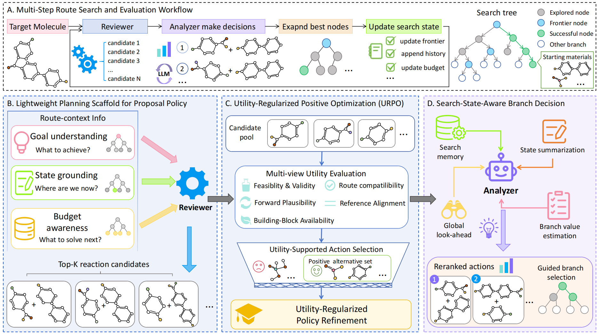

# RetroRoute

Effective multistep retrosynthetic planning requires reaction decisions to remain useful beyond the current decomposition step. However, conventional systems often train reaction proposal models from isolated product reactant pairs and rank candidate reactions using local prediction scores, creating a mismatch between single step plausibility and route level utility. This mismatch becomes more pronounced as synthesis depth increases and early decisions affect the unresolved frontier and subsequent search trajectory.

We introduce **RetroRoute**, a route level agentic framework for multistep retrosynthesis that connects planning conditioned reaction generation, utility guided proposal refinement, and search state aware decision making within an explicit route search process. First, RetroRoute equips a MolT5 proposal model with a lightweight planning scaffold containing the final target, current molecule, search depth, and route completion objective, allowing reaction generation to incorporate planning relevant context without requiring explicit reasoning traces. Second, **Utility Regularized Positive Optimization (URPO)** evaluates self generated reaction alternatives using complementary chemical and route utility signals and incorporates supported candidates as additional positive supervision. Third, a ChemDFM based decision model jointly observes the target, unresolved frontier, route history, search budget, stock information, and candidate reaction set, and learns listwise preferences for state dependent branch selection.

By separating candidate support from route dependent branch evaluation, RetroRoute connects local reaction prediction with multistep planning objectives while preserving an explicit and inspectable search procedure. Experiments on RetroBench show that the planning scaffold, URPO refinement, and state aware decision model contribute complementary improvements. RetroRoute also achieves competitive route recovery under beam search and improves Greedy DFS performance, where candidate ordering has a more direct effect on route completion.

## Framework

The overall architecture of RetroRoute is illustrated below.


## Repository Structure

```text
RetroRoute/
├── ChemDFM/
│   └── README.md
├── MolT5/
│   └── README.md
├── ReactionT5/
│   └── README.md
├── dataset/
│   ├── README.md
│   ├── test_dataset.json
│   └── valid_dataset.json
├── dataset_process/
│   ├── README.md
│   ├── preprocess_multistep_retro.py
│   ├── build_single_step_dataset.py
│   └── filter_single_step_overlaps.py
├── single_step_model/
│   ├── README.md
│   ├── train_molt5_route_context_sft.py
│   ├── eval_molt5_topk.py
│   ├── generate_route_context_candidates.py
│   ├── build_u_positive_sft_data.py
│   └── train_molt5_route_context_positive_sft.py
├── build_chemdfm_dataset.py
├── train_chemdfm.py
├── multistep_test.py
├── Framework.pdf
└── README.md
```

## External Models

The pretrained model weights are not included in this repository.

Prepare the following models before running RetroRoute:

```text
MolT5/model/
ReactionT5/model/
ChemDFM/model/
```

The MolT5 checkpoint follows the model used by RetroInText. The ReactionT5 forward reaction model follows the public ReactionT5 implementation. The chemistry LLM follows the public ChemDFM release.

See the README files inside `MolT5/`, `ReactionT5/`, and `ChemDFM/` for details.

## Dataset

RetroRoute uses RetroBench following the FusionRetro evaluation protocol.

The repository contains:

```text
dataset/valid_dataset.json
dataset/test_dataset.json
```

The training set is not stored in this repository because of its file size. Download the RetroBench training data from the FusionRetro/RetroBench release used by RetroInText and place it at:

```text
dataset/train_dataset.json
```

The ZINC starting material stock is also required:

```text
dataset/zinc_stock_17_04_20.hdf5
```

See [`dataset/README.md`](./dataset/README.md) for details.

## Reproduction Pipeline

All commands below are intended to be executed from the repository root.

The complete training and evaluation order is:

```text
RetroBench raw routes
        |
        v
Multistep route preprocessing
        |
        v
Single step reaction extraction
        |
        v
Train/validation/test overlap removal
        |
        v
Planning Scaffold MolT5 SFT
        |
        v
Top 20 candidate generation
        |
        v
Utility scoring
        |
        v
Utility supported positive data construction
        |
        v
URPO proposal refinement
        |
        v
ChemDFM search state dataset construction
        |
        v
ChemDFM LoRA adaptation
        |
        v
Multistep RetroRoute evaluation
```

Detailed preprocessing and proposal model commands are provided in:

```text
dataset_process/README.md
single_step_model/README.md
```

The remaining ChemDFM training and multistep evaluation steps are described below.

## 1. Create ChemDFM Training States

The ChemDFM training data are constructed using the URPO refined proposal model.

The experiments use the epoch 6 proposal checkpoint:

```text
outputs/molt5_urpo/checkpoint-epoch-6
```

Create the training split:

```bash
mkdir -p ./outputs/chemdfm_dataset

nohup python build_chemdfm_dataset.py \
  --input_json ./dataset/processed/train_dataset_grouped.json \
  --input_format grouped \
  --split_name train \
  --model_dir ./outputs/molt5_urpo/checkpoint-epoch-6 \
  --stock_path ./dataset/zinc_stock_17_04_20.hdf5 \
  --output_jsonl ./outputs/chemdfm_dataset/train_chemdfm.jsonl \
  --report_json ./outputs/chemdfm_dataset/train_report.json \
  --checkpoint_json ./outputs/chemdfm_dataset/train_checkpoint.json \
  --topk 10 \
  --num_beams 10 \
  --batch_size 4 \
  --max_depth 14 \
  --max_reactants 5 \
  --max_history_steps 6 \
  --fp16 \
  --overwrite \
  > build_chemdfm_train.log 2>&1 &
```

Create the validation split:

```bash
nohup python build_chemdfm_dataset.py \
  --input_json ./dataset/processed/valid_dataset_grouped.json \
  --input_format grouped \
  --split_name valid \
  --model_dir ./outputs/molt5_urpo/checkpoint-epoch-6 \
  --stock_path ./dataset/zinc_stock_17_04_20.hdf5 \
  --output_jsonl ./outputs/chemdfm_dataset/valid_chemdfm.jsonl \
  --report_json ./outputs/chemdfm_dataset/valid_report.json \
  --checkpoint_json ./outputs/chemdfm_dataset/valid_checkpoint.json \
  --topk 10 \
  --num_beams 10 \
  --batch_size 4 \
  --max_depth 14 \
  --max_reactants 5 \
  --max_history_steps 6 \
  --fp16 \
  --overwrite \
  > build_chemdfm_valid.log 2>&1 &
```

The main outputs are:

```text
outputs/chemdfm_dataset/
├── train_chemdfm.jsonl
├── valid_chemdfm.jsonl
├── train_report.json
├── valid_report.json
├── train_checkpoint.json
└── valid_checkpoint.json
```

## 2. Train the Search State Aware ChemDFM

ChemDFM is adapted using LoRA with a listwise candidate ranking objective.

```bash
mkdir -p ./outputs/chemdfm_adapter

nohup env CUDA_VISIBLE_DEVICES=0 python train_chemdfm.py \
  --train_jsonl ./outputs/chemdfm_dataset/train_chemdfm.jsonl \
  --valid_jsonl ./outputs/chemdfm_dataset/valid_chemdfm.jsonl \
  --model_dir ./ChemDFM/model \
  --output_dir ./outputs/chemdfm_adapter \
  --max_candidates 10 \
  --max_history_steps 6 \
  --max_length 2048 \
  --include_molt5_rank \
  --include_validity \
  --include_stock \
  --randomize_candidate_ids \
  --load_in_4bit \
  --bf16 \
  --gradient_checkpointing \
  --lora_r 16 \
  --lora_alpha 32 \
  --lora_dropout 0.05 \
  --learning_rate 1e-4 \
  --weight_decay 0.01 \
  --batch_size 1 \
  --eval_batch_size 2 \
  --grad_accum_steps 32 \
  --epochs 3 \
  --warmup_ratio 0.03 \
  --max_grad_norm 1.0 \
  --early_stop_patience 2 \
  --logging_steps 20 \
  --save_every_epoch \
  > train_chemdfm.log 2>&1 &
```

The training script saves the adapted ChemDFM checkpoints under:

```text
outputs/chemdfm_adapter/
```

Use the selected adapter checkpoint for multistep evaluation. If the training script saves separate epoch checkpoints, replace the adapter path below with the selected checkpoint directory.

## 3. Multistep RetroRoute Evaluation

The main evaluation combines the URPO refined MolT5 proposal model and the adapted ChemDFM branch decision model.

```bash
mkdir -p ./outputs/multistep_eval

nohup python multistep_test.py \
  --test_multistep_json ./dataset/processed/test_dataset_grouped.json \
  --generator_model_dir ./outputs/molt5_urpo/checkpoint-epoch-6 \
  --chemdfm_base_model ./ChemDFM/model \
  --chemdfm_adapter ./outputs/chemdfm_adapter \
  --stock_path ./dataset/zinc_stock_17_04_20.hdf5 \
  --output_dir ./outputs/multistep_eval \
  --single_step_topk 10 \
  --single_step_num_beams 10 \
  --ranker_num_candidates 10 \
  --ranker_keep_topm 5 \
  --route_beam_size 5 \
  --eval_topk 5 \
  --ranker_score_weight 1.0 \
  --molt5_score_weight 0.0 \
  --length_norm_gamma 0.0 \
  --depth_penalty 0.0 \
  --max_depth 14 \
  --max_search_steps 14 \
  --search_depth_limit_mode global \
  --max_reactants 5 \
  --max_history_steps 6 \
  --expand_all_unsolved \
  --stop_when_enough_complete \
  --skip_bad_actions \
  --run_greedy_dfs \
  --greedy_depth_limit_mode gt \
  --greedy_num_candidates 5 \
  --sample_size -1 \
  --sample_seed 42 \
  --load_chemdfm_in_4bit \
  --chemdfm_bf16 \
  --fp16 \
  > multistep_test.log 2>&1 &
```

The main beam search uses a global maximum search depth of 14. Greedy DFS uses the ground truth route depth as its depth limit following the RetroBench evaluation protocol.

## Output Organization

A recommended directory structure after completing the pipeline is:

```text
outputs/
├── molt5_route_context/
├── molt5_topk/
├── route_candidates_top20/
├── utility_scores/
├── urpo_data/
├── molt5_urpo/
├── chemdfm_dataset/
├── chemdfm_adapter/
└── multistep_eval/
```

## Notes

- All main multistep experiments use a route beam size of 5.
- MolT5 generates 10 candidates per search expansion during final evaluation.
- ChemDFM reranks up to 10 candidates and retains 5 actions for expansion.
- The maximum search depth and maximum number of search rounds are both 14.
- The random seed used in the final evaluation is 42.
- The selected URPO proposal checkpoint used in the reported experiments is epoch 6.
- Model weights and the full RetroBench training set are not tracked by Git.

## Acknowledgements

RetroRoute builds on resources from RetroBench/FusionRetro, RetroInText, MolT5, ReactionT5, and ChemDFM. Please cite the corresponding original works when using these resources.
